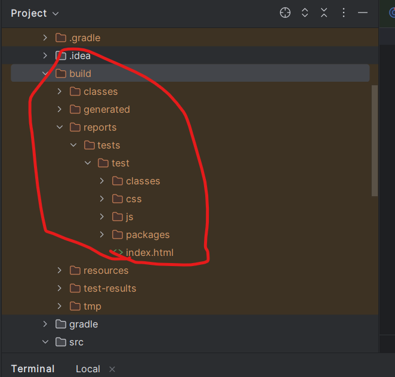

App ID 1 = 6f58657977ff9426c92b7b575f573326

App ID 2 = 31cec4be781b1350e07de2bcf17f1b68

App ID 3 = b24edfa15656b8f9cea3702219f82de0

cara Running di-terminal =  ./gradlew test

Method testPredictWeather => Cek cuaca di Jakarta selatan

Method testAirPolution => cek polusi udara di jakarta selatan 

Jika sudah di run maka akan generate folder build. Lalu jalankan HTML tersebut untuk cek hasil dari testing API.

